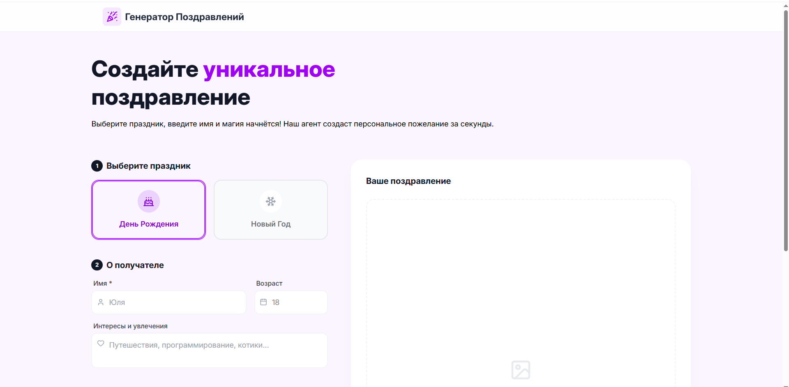

# 🎉 Greeting Generator AI — Генератор поздравлений

AI-приложение для создания персональных поздравлений и тематических открыток.

Пользователь указывает повод, имя, возраст, интересы, язык и желаемый тон поздравления — приложение генерирует уникальный текст с помощью **Google Gemini**, а при необходимости дополнительно создаёт изображение поздравительной открытки с помощью **Cloudflare Workers AI**.

🔗 **Демо:** https://superpnz.github.io/greeting_generator_ai/
📦 **Репозиторий:** https://github.com/Superpnz/greeting_generator_ai

---

## 📸 Скриншоты

### Главный экран



### Результат генерации


### Мобильная версия


---

## 🎯 О проекте

Это учебно-практический проект, созданный для работы с современным React-стеком и интеграции AI-сервисов в frontend-приложение.

Основной фокус проекта:

* Разработка интерфейса на **React + TypeScript**
* Работа с AI API
* Разделение frontend и серверной части для защиты API-ключа
* Генерация текста и изображений
* Работа с асинхронными запросами и состояниями загрузки
* Адаптивная верстка
* Деплой frontend-приложения на GitHub Pages

---

## ✨ Функциональность

### 🤖 Генерация поздравлений

Пользователь может указать:

* повод для поздравления
* имя получателя
* возраст
* интересы и хобби
* тон поздравления
* язык

После этого **Google Gemini** генерирует уникальное поздравление с учётом введённых данных.

Поддерживаются различные варианты тона:

* официальный
* дружеский
* юмористический
* романтический
* трогательный
* 18+

### 🖼️ Генерация изображения

Дополнительно можно включить генерацию изображения поздравительной открытки.

Для генерации используется **Cloudflare Workers AI** с моделью Stable Diffusion XL Lightning.

### 🌍 Несколько языков

Поздравление можно генерировать на выбранном пользователем языке.

### 📋 Работа с результатом

После генерации пользователь может:

* прочитать созданное поздравление
* скопировать текст
* просмотреть сгенерированную открытку
* скачать изображение

### 📱 Адаптивный интерфейс

Интерфейс адаптирован под:

* мобильные устройства
* планшеты
* десктопы

---

## 🔐 Архитектура и безопасность

Frontend приложения размещён на **GitHub Pages** и не обращается к Gemini API напрямую.

Запросы проходят через отдельный **Cloudflare Worker**:

```text
React + TypeScript
        │
        ├── текст ──────────► Cloudflare Worker ──► Google Gemini
        │
        └── изображение ───► Cloudflare Worker ──► Cloudflare Workers AI
```

API-ключ Gemini хранится в **Cloudflare Worker Secrets** и не попадает в frontend-код или GitHub-репозиторий.

Это позволяет использовать GitHub Pages для размещения приложения, не публикуя секретный API-ключ в браузере.

---

## 🛠️ Стек технологий

### Frontend

* **React 19**
* **TypeScript**
* **Vite**
* **Tailwind CSS**
* **Lucide React**

### AI

* **Google Gemini API** — генерация текста
* **Cloudflare Workers AI** — генерация изображений
* **Stable Diffusion XL Lightning** — модель генерации изображений

### Backend / Infrastructure

* **Cloudflare Workers** — проксирование AI-запросов и защита API-ключа
* **Cloudflare Secrets** — хранение Gemini API key

### Deployment

* **GitHub Pages** — hosting frontend
* **GitHub Actions** — автоматическая сборка и деплой

### Инструменты

* **Git**
* **GitHub**
* **ESLint**
* **Prettier**

---

## 📁 Архитектура проекта

### Frontend

```bash
greeting_generator_ai/
├── .github/
│   └── workflows/
│       └── deploy.yml          # GitHub Actions
│
├── public/                     # статические файлы
│
├── src/
│   ├── components/             # UI-компоненты
│   │   ├── AppTitle.tsx
│   │   ├── ExtraDetailsSection.tsx
│   │   ├── GenerateButton.tsx
│   │   ├── Header.tsx
│   │   ├── OccasionButton.tsx
│   │   ├── ResultSection.tsx
│   │   ├── ToneSelector.tsx
│   │   └── ...
│   │
│   ├── services/
│   │   ├── geminiService.ts    # запросы генерации текста
│   │   └── imageService.ts     # запросы генерации изображений
│   │
│   ├── App.tsx
│   ├── main.tsx
│   ├── constants.ts
│   └── types.ts
│
├── index.html
├── vite.config.ts
├── package.json
└── tsconfig.json
```

### Cloudflare Worker

```bash
greeting-generator-worker/
├── src/
│   └── index.ts                # обработка AI-запросов
│
├── wrangler.jsonc              # конфигурация Worker
└── package.json
```

---

## ⚙️ Установка и запуск

### 📥 Клонирование репозитория

```bash
git clone https://github.com/Superpnz/greeting_generator_ai.git
cd greeting_generator_ai
```

### 📦 Установка зависимостей

```bash
npm install
```

### ▶️ Запуск в режиме разработки

```bash
npm run dev
```

После запуска приложение будет доступно по адресу:

```text
http://localhost:1111/greeting_generator_ai/
```

---

## 🔑 Переменные окружения

Для frontend-части API-ключ Gemini не требуется.

Ключ хранится на стороне Cloudflare Worker и передаётся через Cloudflare Secrets.

Для локальной разработки frontend использует URL Worker:

```ts
const WORKER_URL =
  "https://greeting-generator-worker.maksim9431.workers.dev";
```

> API-ключ Gemini не хранится в frontend-коде и не добавляется в GitHub-репозиторий.

---

## 🚀 Деплой

Frontend автоматически деплоится на **GitHub Pages** через GitHub Actions.

После push в ветку `main` выполняются:

1. Установка зависимостей
2. Сборка проекта
3. Создание GitHub Pages artifact
4. Деплой приложения

Актуальная версия приложения:

**https://superpnz.github.io/greeting_generator_ai/**

---

## 💡 Что было реализовано в проекте

В процессе разработки были реализованы и изучены:

* React-компонентная архитектура
* TypeScript типизация
* Управление состоянием через React Hooks
* Асинхронная работа с API
* Обработка состояний loading / error / success
* Работа с `fetch`
* Интеграция Google Gemini API
* Интеграция Cloudflare Workers AI
* Генерация изображений через Stable Diffusion
* Создание собственного API-прокси на Cloudflare Workers
* Защита API-ключа от публикации на frontend
* Работа с GitHub Actions
* Деплой React-приложения на GitHub Pages
* Адаптивная верстка с Tailwind CSS

---

## 👨‍💻 Автор

**Superpnz / Maxim Anikeev**

GitHub: https://github.com/Superpnz
